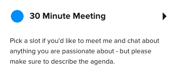

# Hello 👋, I'm Kyle

### Software Engineer // Developer // Nerd


### A little about me... 😎

```swift
import CaffeineKit
import NerdKit
import SwiftUI

struct Kyle: View {
    let currentActivity = "Building the next big thing"
    let currentLocation = "Amarillo, TX"
    let askMeAbout: [Questions] = [programming, apple tech, shortcuts]
    let languages: [Languages] = [php, python, java, swift, javascript, html, css]
    let tools: [Software] = [VS Code, Xcode, Git]
    let interests: [Interests] = [programming, apple tech, family, music]
    var favoriteDrink: String {
        let calendar = Calendar.current
        let hour = calendar.component(.hour, from: .now)
        if hour < 12 {
            return "Coffee"
        } else if hour < 18 {
            return "Dr Pepper, Tea, or Water"
        } else {
            return "Tea or Water"
        }
    }

    var body: some View {
        VStack {
            Text("Hello, I'm Kyle")
            Text("I'm currently \(currentActivity) in \(currentLocation)")
            Text("Some programming lanuages I know are: \(languages)")
            Text("Tools that I use regularly: \(tools)")
            Text("I'm interested in: \(interests)")
            Text("You can ask me about: \(askMeAbout)")
            Text("My favorite drink is \(favoriteDrink)")
        }
    }
}
```

### Let's meet and chat!

[][calendly30min]

👇 Type the following in your console or terminal to connect with me.

```bash
npx kylereddoch
```

**👆 This command line tool can be [found here](https://github.com/kylereddoch/npx_card). <!-- If you are interested in learning how to make your own command line tool, check out my [article here]().-->**

### Where you can find me

- [My website][website]
- [Mastodon][mastodon]
- [Pixelfed][pixelfed]

### Check out what I am currently up to 👇🏼

[Here's what I'm up to][now].

---

### 📝 Latest Blog Posts

<!-- BLOG-POST-LIST:START -->
- [How to Add a Mastodon Share Button to Your Website](https://kylereddoch.me/2023/02/20/creating-mastodon-share-button.html)
- [Using an Alias for Your Mastodon Account with Jekyll and GitHub Pages](https://kylereddoch.me/2023/02/15/using-alias-for-mastodon-account-jekyll-github-pages.html)
- [Adding Mastodon Comments to a Jekyll Blog](https://kylereddoch.me/2023/02/13/adding-mastodon-comments-jekyll-blog.html)
- [Tutorial: Create a Simple npx Business Card](https://kylereddoch.me/2022/09/26/create-a-simple-npx-business-card.html)
- [Tutorial: Pseudocode and Flowcharts for Coding](https://kylereddoch.me/2022/03/19/pseudocode-and-flowcharts.html)
<!-- BLOG-POST-LIST:END -->

➡️ [more blog posts...](https://kylereddoch.me)

---

### 📊 GitHub Stats

<p></p>
<p></p>

---

<!--START_SECTION:waka-->


**🐱 My GitHub Data** 

> 📦 103.4 kB Used in GitHub's Storage 
 > 
> 🏆 76 Contributions in the Year 2023
 > 
> 💼 Opted to Hire
 > 
> 📜 28 Public Repositories 
 > 
> 🔑 3 Private Repositories 
 > 
**I'm a Night 🦉** 

```text
🌞 Morning                43 commits          ██░░░░░░░░░░░░░░░░░░░░░░░   07.86 % 
🌆 Daytime                141 commits         ██████░░░░░░░░░░░░░░░░░░░   25.78 % 
🌃 Evening                289 commits         █████████████░░░░░░░░░░░░   52.83 % 
🌙 Night                  74 commits          ███░░░░░░░░░░░░░░░░░░░░░░   13.53 % 
```
📅 **I'm Most Productive on Sunday** 

```text
Monday                   70 commits          ███░░░░░░░░░░░░░░░░░░░░░░   12.80 % 
Tuesday                  68 commits          ███░░░░░░░░░░░░░░░░░░░░░░   12.43 % 
Wednesday                64 commits          ███░░░░░░░░░░░░░░░░░░░░░░   11.70 % 
Thursday                 54 commits          ██░░░░░░░░░░░░░░░░░░░░░░░   09.87 % 
Friday                   64 commits          ███░░░░░░░░░░░░░░░░░░░░░░   11.70 % 
Saturday                 102 commits         █████░░░░░░░░░░░░░░░░░░░░   18.65 % 
Sunday                   125 commits         ██████░░░░░░░░░░░░░░░░░░░   22.85 % 
```


📊 **This Week I Spent My Time On** 

```text
🕑︎ Time Zone: America/Chicago

💬 Programming Languages: 
No Activity Tracked This Week

🔥 Editors: 
No Activity Tracked This Week

🐱‍💻 Projects: 
No Activity Tracked This Week

💻 Operating System: 
No Activity Tracked This Week
```

**I Mostly Code in C++** 

```text
C++                      6 repos             ███████░░░░░░░░░░░░░░░░░░   28.57 % 
JavaScript               3 repos             ████░░░░░░░░░░░░░░░░░░░░░   14.29 % 
HTML                     2 repos             ██░░░░░░░░░░░░░░░░░░░░░░░   09.52 % 
Swift                    2 repos             ██░░░░░░░░░░░░░░░░░░░░░░░   09.52 % 
Java                     1 repo              █░░░░░░░░░░░░░░░░░░░░░░░░   04.76 % 
```


<!--END_SECTION:waka-->

---

### 🙏🏼 Support

I love being able to offer people the tools/software that help make a difference in their lives. Your support helps continue to make that happen. There is no pressure, though. If you like what I am doing and use what I put out, please consider supporting me through the various options below. I have set up both one-time donations and membership tiers. (Those that support me through memberships get extra perks!)

- [Sponsor me on GitHub :heart:][githubsponsor]
- [Nominate me to GitHub Stars :star2:][githubstars]

<a href="https://www.buymeacoffee.com/kylereddoch" target="_blank"></a>

<a href='https://ko-fi.com/S6S374TCV' target='_blank'></a>

_NOTE: Top languages does not indicate my skill level or anything like that. It is just a metric of which languages have been hosted by me on GitHub based on the usage across repositories. There are others that have not been put on Github._

[website]: https://kylereddoch.me
[mastodon]: https://iosdev.space/@kylewritescode
[pixelfed]: https://pixelfed.social/@kylereddoch
[twitter]: https://twitter.com/winphankyle
[instagram]: https://instagram.com/kyle.reddoch
[linkedin]: https://linkedin.com/in/kylereddoch
[wakatime]: https://wakatime.com/@10619014-9413-4a5b-a3df-2d3892b8a73d
[telegram]: https://t.me/kylereddoch
[email]: kylereddoch@me.com
[hwscourses]: https://www.hackingwithswift.com
[githubstars]: https://stars.github.com/nominate/
[githubsponsor]: https://github.com/sponsors/kylereddoch
[now]: https://kylereddoch.me/now/
[calendly30min]: https://calendly.com/kylewritescode/30min
