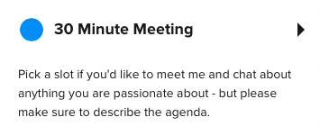

# Hello 👋, I'm Kyle (aka CybersecKyle)

### Cybersecurity & IT Solutions Leader

 

[](https://visitorbadge.io/status?path=https%3A%2F%2Fgithub.com%2Fkylereddoch%2Fkylereddoch)

```python
# totally_legit_cybersec_profile.py

import time
import random
import hashlib as threat_hash
import socket as sock_puppet
import secrets as opsec

from datetime import datetime

current_activity = "Defending networks & breaking down threats"
current_location = "Amarillo, TX"
languages = ["Python", "PowerShell", "Bash", "JavaScript", "HTML", "CSS"]
tools = ["Wireshark", "Kali Linux", "Nmap", "Metasploit", "VS Code", "Git"]
interests = ["cybersecurity", "incident response", "automation", "family", "music"]
ask_me_about = ["threat detection", "MSP life", "blue team tactics", "automation scripts"]

def favorite_drink():
    hour = datetime.now().hour
    if hour < 12:
        return "Coffee ☕ (morning firewall fuel)"
    elif hour < 18:
        return "Dr Pepper 🥤 or Water 💧 (pentest hydration)"
    else:
        return "Tea 🍵 (for late-night log analysis)"

def boot_sequence():
    banners = [
        "[*] Initializing CybersecKyle persona...",
        "[*] Loading threat intelligence modules...",
        "[*] Compiling scripts of doom...",
        "[+] Profile boot complete."
    ]
    for msg in banners:
        print(msg)
        time.sleep(0.5)

def generate_session_id():
    return threat_hash.sha256(opsec.token_bytes(8)).hexdigest()[:12]

# Run profile
boot_sequence()
print(f"Hello, I'm Kyle (aka CybersecKyle)")
print(f"Session ID: {generate_session_id()}")
print(f"Current status: {current_activity} in {current_location}")
print(f"Languages in my arsenal: {', '.join(languages)}")
print(f"Tools in my kit: {', '.join(tools)}")
print(f"My interests: {', '.join(interests)}")
print(f"Ask me about: {', '.join(ask_me_about)}")
print(f"Favorite drink at this hour: {favorite_drink()}")
print("[!] Warning: Unauthorized packets will be dropped 🚫📡")
```

### Let's meet and chat!

[][calendly30min]

👇 Type the following in your console or terminal to connect with me.

```bash
npx kylereddoch
```

**👆 This command line tool can be [found here](https://github.com/kylereddoch/npx_card). <!-- If you are interested in learning how to make your own command line tool, check out my [article here]().-->**

### Where you can find me

- [My website][website]
- [Mastodon][mastodon]
- [Instagram][instagram]

<!-- ### Check out what I am currently up to 👇🏼

[Here's what I'm up to][now]. -->

---

### 📝 Latest Blog Posts

<!-- BLOG-POST-LIST:START -->
- [Weekly Notes: Big Comfort Upgrades and a Useful Little Script &lpar;Week 8, 2026&rpar;](https://www.kylereddoch.me/blog/weekly-notes-big-comfort-upgrades-and-a-useful-little-script-week-8-2026/)
- [Fighting the PUP Wave: A Practical PowerShell Cleanup Workflow for MSPs](https://www.kylereddoch.me/blog/fighting-the-pup-wave-a-practical-powershell-cleanup-workflow-for-msps/)
- [Weekly Notes: WFH Mode, Olympics Nights, and F1 Is Back &lpar;Week 7, 2026&rpar;](https://www.kylereddoch.me/blog/weekly-notes-wfh-mode-olympics-nights-and-f1-is-back-week-7-2026/)
- [Goodbye, Ring. I&#39;m Not Buying Into Your Mass Surveillance.](https://www.kylereddoch.me/blog/goodbye-ring-im-not-buying-into-your-mass-surveillance/)
- [Weekly Notes: Small Upgrades, Loud Lessons &lpar;Week 6, 2026&rpar;](https://www.kylereddoch.me/blog/weekly-notes-small-upgrades-loud-lessons-week-6-2026/)
<!-- BLOG-POST-LIST:END -->

➡️ [more blog posts...](https://www.kylereddoch.me/blog/)

---

### 📊 GitHub Stats

<p></p>
<p></p>

NOTE: Top languages does not indicate my skill level or anything like that. It is just a metric of which languages have been hosted by me on GitHub based on the usage across repositories. There are others that have not been put on Github.

---

### 🙏🏼 Support

I love being able to offer people the tools/software that help make a difference in their lives. Your support helps continue to make that happen. There is no pressure, though. If you like what I am doing and use what I put out, please consider supporting me through the various options below. I have set up both one-time donations and membership tiers. (Those that support me through memberships get extra perks!)

- [Sponsor me on GitHub :heart:][githubsponsor]
- [Nominate me to GitHub Stars :star2:][githubstars]

<a href="https://www.buymeacoffee.com/kylereddoch" target="_blank"></a>

<a href='https://ko-fi.com/S6S374TCV' target='_blank'></a>

[website]: https://kylereddoch.me
[mastodon]: https://infosec.exchange/@cyberseckyle
[instagram]: https://instagram.com/@cyberseckyle
[twitter]: https://twitter.com/winphankyle
[linkedin]: https://linkedin.com/in/kylereddoch
[wakatime]: https://wakatime.com/@10619014-9413-4a5b-a3df-2d3892b8a73d
[email]: kylereddoch@proton.me
[hwscourses]: https://www.hackingwithswift.com
[githubstars]: https://stars.github.com/nominate/
[githubsponsor]: https://github.com/sponsors/kylereddoch
[now]: https://now.kylereddoch.me/
[calendly30min]: https://calendly.com/beardedtechguy/30min
